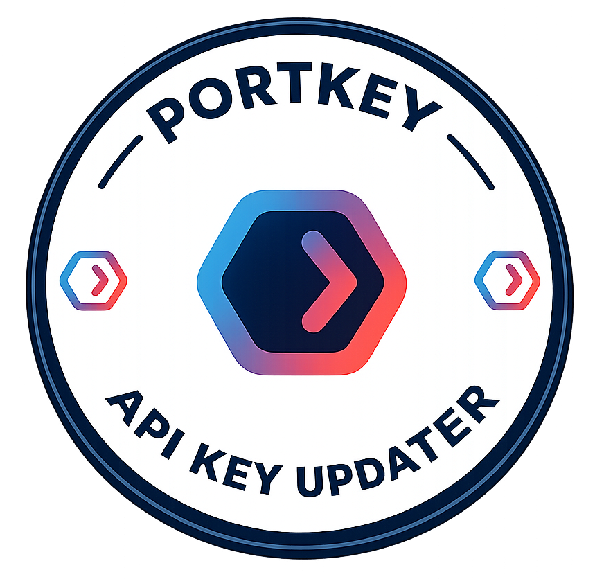

# Portkey API Key Updater

[](https://www.apple.com/macos/)
[](https://www.zsh.org/)
[](https://www.python.org/)
[](https://portkey.ai/)
[](https://github.com/Enelass/portkey-api-renewal/actions/workflows/changelog.yml)
[](https://github.com/Enelass/portkey-api-renewal/releases)

<p align="center">
  
</p>

Automate Portkey API key renewal on macOS. The tool reads your authenticated Portkey browser session, finds the newest active unexpired API key for a configured workspace, stores it in macOS Keychain, and creates a new key when no usable key exists.

## Quick Start

### 1. Install

```bash
git clone https://github.com/Enelass/portkey-api-renewal.git
cd portkey-api-renewal
uv venv && source .venv/bin/activate
uv pip install -e .
```

### 2. Configure

Copy the template and fill in your Portkey workspace details:

```bash
cp config/config.template.json config/config.json
```

Required values in `config/config.json`:

```json
{
  "oauth": {
    "base_url": "https://your-portkey-domain.com",
    "workspace_id": "your-workspace-id",
    "organisation_id": "your-organisation-id"
  }
}
```

The template also includes the key name, scopes, defaults, expiry policy, and Portkey endpoints used for listing and creating keys.

### 3. Store and expose the active key

Run the checker while logged in to Portkey in Chrome, Edge, Firefox, or Brave:

```bash
portkey-check
```

The active key is stored in Keychain as `PORTKEY_API_KEY`. Add shell exports as needed:

```bash
export PORTKEY_API_KEY=$(security find-generic-password -s "PORTKEY_API_KEY" -w)
```

## Commands

```bash
portkey-check              # Select newest active unexpired key, or create one if needed
portkey-check --renew      # Force creation of a new key
portkey-renew              # Create a new key interactively
portkey-get-bearer         # Validate browser bearer-token extraction
python3 main.py check      # Root dispatcher
```

Legacy aliases `check-key`, `renew-key`, and `get-bearer` remain available.

## Behavior

Portkey can keep multiple keys active. This tool always lists keys from `/albus/v2/api-keys?workspace_id=...`, ignores inactive or expired keys, and selects the active unexpired key with the newest `created_at`. If none exists, it creates a new key through `/albus/v2/api-keys/workspace/user`.

## Security Report

`portkey-check` runs a console environment verification after selecting the active key. To generate the HTML security report manually:

```bash
generate-report
python3 main.py report
```

The report is written to `logs/security_report.html`.

## Requirements

- macOS
- Python 3.8 through 3.12
- `uv` for the recommended local setup
- An active Portkey browser session in Chrome, Edge, Firefox, or Brave

Safari is not supported for automated cookie extraction.

## Troubleshooting

- `No bearer token found`: sign in to Portkey in a supported browser and rerun the command.
- `Portkey API key list failed`: verify `base_url`, `workspace_id`, and your browser session.
- Keychain prompts: allow Terminal access to macOS Keychain.
- Keep `config/config.json` private, for example `chmod 600 config/config.json`.

<p align="center">
  
</p>

## License

MIT License. See [LICENSE](LICENSE).
